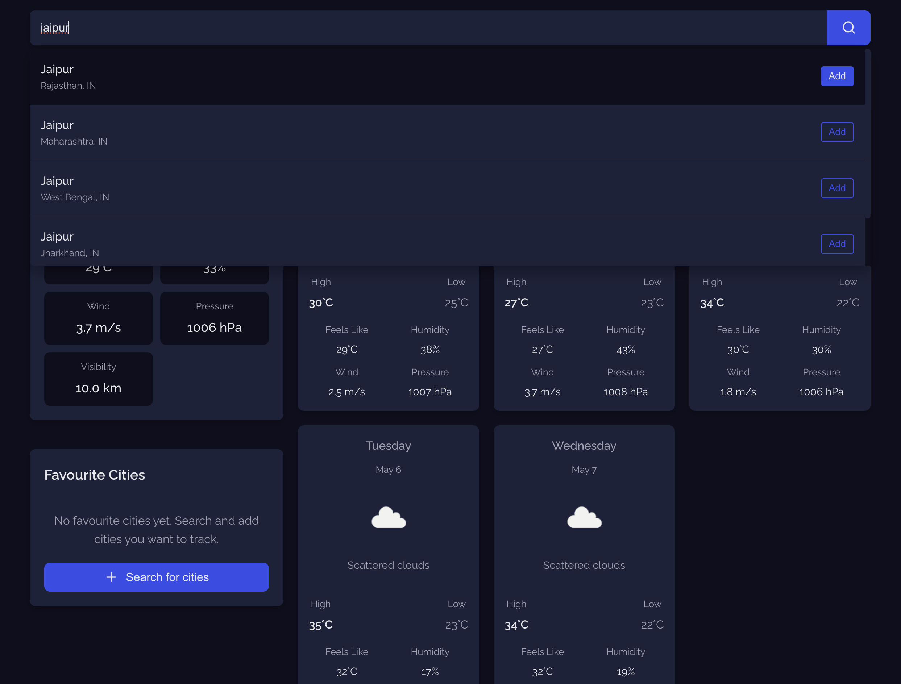
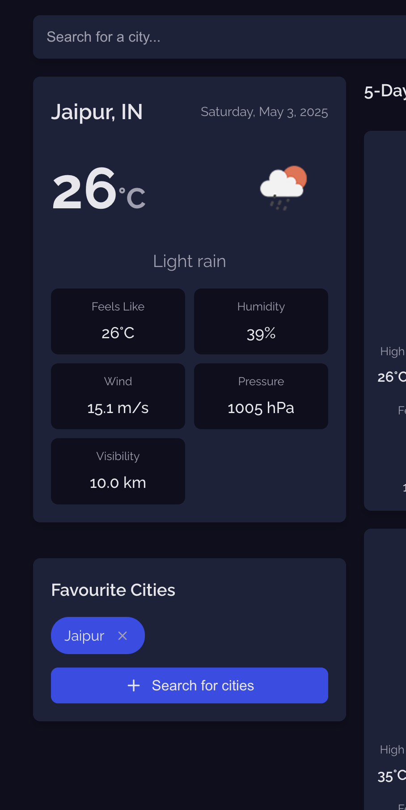
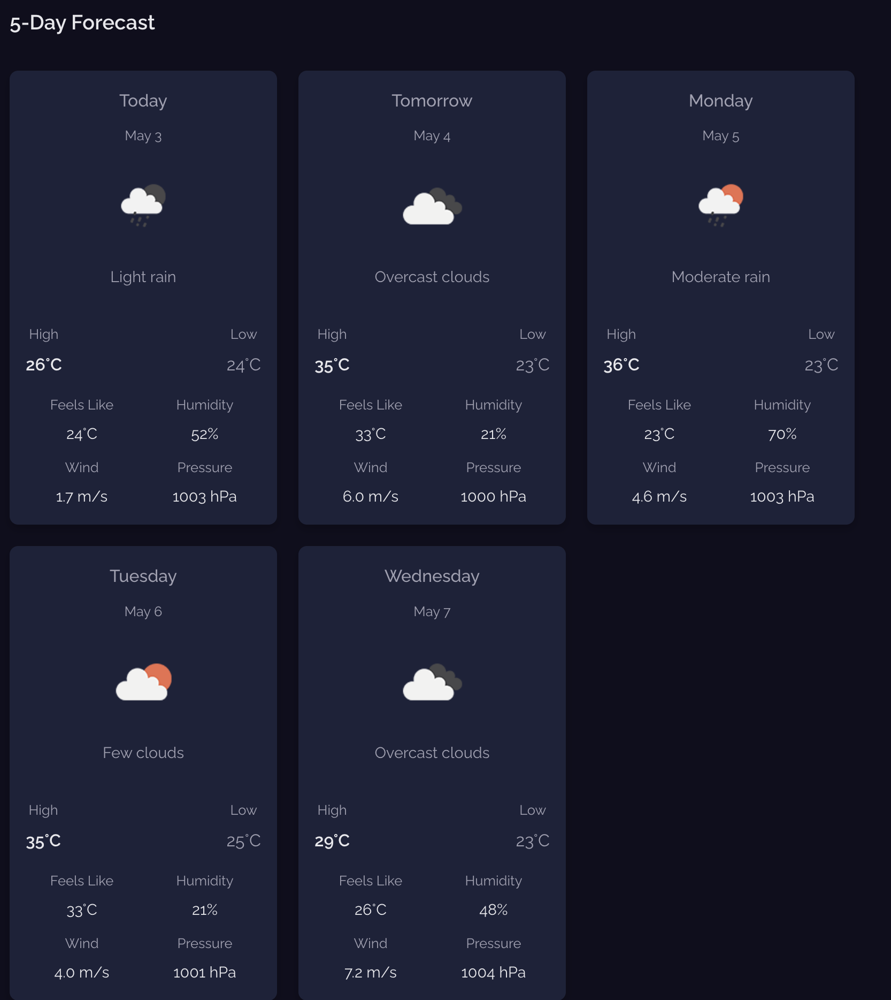

# 🌤️ Weather Dashboard

A sleek, React-based weather application where users can search for any city and instantly get current weather updates. Favorite cities can be saved for quick access and weather data is fetched using the OpenWeatherMap API.

---

## 🔗 Live Demo

**Hosted on Vercel:** [View Live Project](https://your-vercel-link.vercel.app)  
**GitHub Repo:** [weather-dashboard-project](https://github.com/vibhuti2006/weather-dashboard-project)

---

## 📌 Features

- 🌍 **Search Weather by City**  
  Users can type any city name to get the current weather data (temperature, humidity, conditions, etc.).

- ⭐ **Add to Favorites**  
  Save frequently searched cities and display them in a sidebar.

- 💾 **Persistent Favorites**  
  Favorites are stored in `localStorage` so they're available even after refreshing or revisiting the app.

- ⛅ **Weather Icons**  
  Dynamic icons displayed based on the weather condition.

- 🔁 **Quick Updates**  
  Clicking a city from the favorites re-fetches and shows the latest weather data.

- 🌐 **Context-based State Management**  
  The app uses React Context API to manage:
  - Current weather
  - Favorite cities
  - Last searched city

---

## 📸 Preview


---

---



---

## 🧰 Technologies Used

| Category           | Tools / Services                     |
|--------------------|---------------------------------------|
| **Frontend**       | React, Vite                          |
| **Styling**        | Manual CSS                           |
| **State Mgmt**     | Context API                          |
| **Animation**      | Custom CSS                           |
| **API**            | [OpenWeatherMap API](https://openweathermap.org/api) |
| **Hosting**        | [Vercel](https://vercel.com/)        |

---

## 📁 Project Structure

```
weather-dashboard-project/
│
├── public/
│   └── index.html              # Root HTML file
│
├── src/
│   ├── assets/                 # Icons, images, etc.
│   ├── components/             
│   │   ├── SearchBar.jsx       # Input for city search
│   │   ├── CurrentWeather.jsx  # Displays current weather details
│   │   ├── FavoriteCities.jsx  # Sidebar of saved cities
│   │   └── WeatherCard.jsx     # Individual weather card component
│   │
│   ├── context/
│   │   └── WeatherContext.jsx # Global state (weather, favorites, etc.)
│   │
│   ├── App.jsx                 # Main app layout & router
│   ├── main.jsx                # React entry point
│   └── main.css              # Global and component styles
│
├── .gitignore
├── index.html
├── package.json
└── vite.config.js
```

---

## 🧩 Component Descriptions

| Component           | Description |
|---------------------|-------------|
| **App**             | Root component that initializes the layout and wraps everything in `WeatherProvider`. |
| **WeatherProvider** | Provides and manages global state (weather data, favorites, search history). |
| **SearchBar**       | Input field for entering a city name to fetch weather data. |
| **CurrentWeather**  | Displays real-time weather details: temperature, humidity, weather description, and icon. |
| **FavoriteCities**  | Sidebar component showing all saved cities with clickable weather updates. |
| **WeatherCard**     | UI card displaying brief weather data for each city. |

---

## 🚀 Getting Started

1. **Clone the repository**
   ```bash
   git clone https://github.com/vibhuti2006/weather-dashboard-project.git
   cd weather-dashboard-project
   ```

2. **Install dependencies**
   ```bash
   npm install
   ```

3. **Add your OpenWeatherMap API key**
   - Create a `.env` file
   - Add your key like this:
     ```env
     VITE_WEATHER_API_KEY=your_api_key_here
     ```

4. **Run the app**
   ```bash
   npm run dev
   ```

---

## 📌 License

This project is open-source.

---

## 🙌 Acknowledgements

- [OpenWeatherMap API](https://openweathermap.org/)
- [Vite](https://vitejs.dev/)
- [Vercel](https://vercel.com/)
